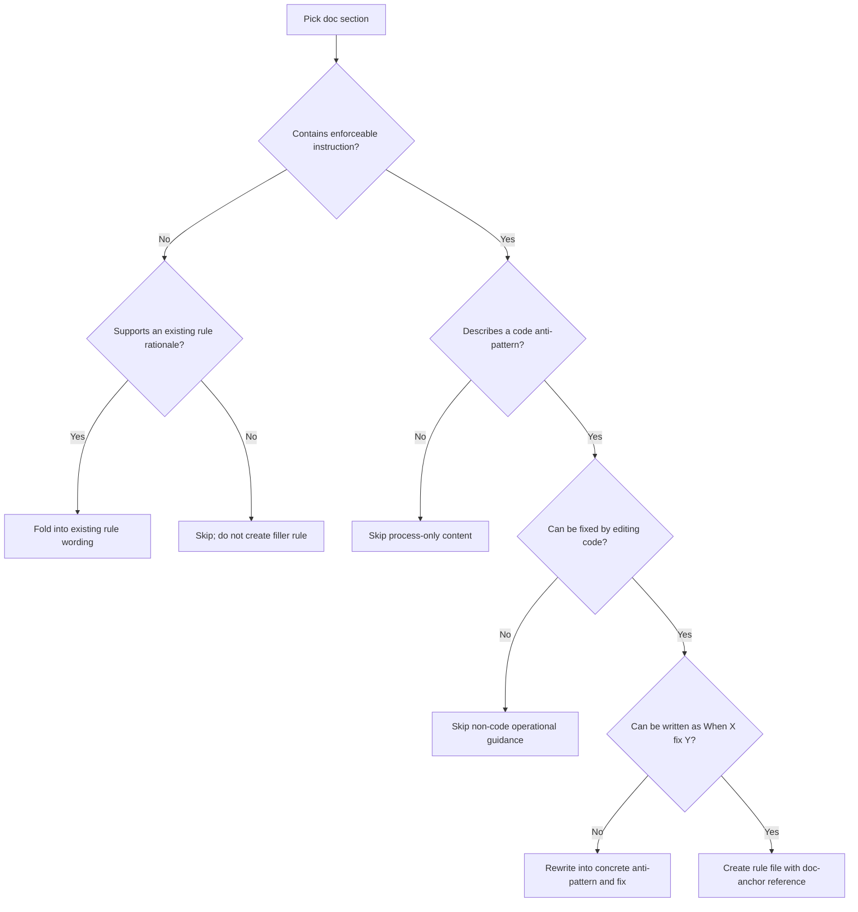

# Rule Generation

Generate a complete `rules/<package>/rules` set from `rules/<package>/docs`.
Keep every rule actionable, meaningful, and traceable to the source docs.
Do not invent claims that are not supported by the input documentation.

## Rule Intent Contract

Rules must teach how to fix codebase anti-patterns.

- Each rule must follow: anti-pattern -> fix pattern.
- Each rule must be applicable by editing source code.
- Validation scripts and quality gates are diagnostics only, not rule subjects.
- Reject process-only rules (how to run checks, flags, output formatting, pipeline orchestration).

## Inputs

- `package`: package slug (for path resolution)
- `docs_root`: `rules/<package>/docs`

## Outputs

- `rules_root`: `rules/<package>/rules`
- Rule files: `<section>-<title>.md`
- Table of contents: `rules/<package>/rules/_toc.md`

## Decision Tree: Docs to Rules



## Required Workflow

1. Read all docs under `rules/<package>/docs`.
2. Build a coverage map from doc sections to candidate rules.
3. Convert diagnostic guidance into code anti-pattern and fix candidates.
4. Keep only candidates that are concrete, enforceable, and code-editable.
5. Generate one rule file per rule using the rule template.
6. Name each rule file as `<section>-<title>.md`.
7. Run strict rule validation script.
8. Generate `_toc.md` from validated rules.
9. Re-run validation with `_toc.md` mapping checks enabled.

## Non-Hallucination Reference Policy

Every rule must cite the source docs directly.

- `Reference:` must point to a docs anchor in this package.
- Required format: `Reference: rules/<package>/docs/<doc-file>.md#<heading-anchor>`
- Do not use generic external references as primary evidence.
- If a rule cannot be traced to a doc section, do not create the rule.

## Diagnostics to Rule Translation

Use validators and gates as detectors of bad patterns, then write the remediation rule.

- Bad rule type: "Run validator X with flag Y"
- Good rule type: "Avoid bare except and use explicit exception handling with contextual re-raise"
- Bad rule type: "Print summary fields from validation output"
- Good rule type: "Keep functions under complexity thresholds by extracting branches into helpers"

## Scripted Validation and TOC Generation

Run these commands in order:

```bash
python .agents/skills/rule-generation/scripts/validate_rules.py "rules/<package>/rules"
python .agents/skills/rule-generation/scripts/generate_toc.py "rules/<package>/rules"
python .agents/skills/rule-generation/scripts/validate_rules.py "rules/<package>/rules" --validate-toc-mapping
```

Rules:

- Do not generate `_toc.md` before rules pass validation.
- Treat validation failures as blocking.
- `_toc.md` must list all generated rules.
- Order by impact descending (`CRITICAL`, `HIGH`, `MEDIUM-HIGH`, `MEDIUM`, `LOW-MEDIUM`, `LOW`).
- Use stable tie-breakers for deterministic output.

## Rule Template

Every generated rule file must follow this structure:

````markdown
---
title: Rule Title Here
impact: MEDIUM
impactDescription: Optional description of impact (e.g., "20-50% improvement")
tags: tag1, tag2
---

## Rule Title Here

**Impact: MEDIUM**

Brief imperative instruction that describes a concrete anti-pattern fix.

**Incorrect:**

```python
def parse_value(raw: str) -> int:
    try:
        return int(raw)
    except:
        return 0
```

**Correct:**

```python
def parse_value(raw: str) -> int:
    return int(raw)
```

Reference: rules/<package>/docs/<doc-file>.md#<heading-anchor>
````

## Example Quality Gate

`Incorrect` and `Correct` blocks must be readable, consistent, and actionable.

- Include at least one real executable statement in each block.
- Do not use comment-only blocks.
- Do not use placeholder-only bodies (`pass`, `...`) as the only logic.
- Ensure incorrect and correct blocks differ in behavior, not just wording.
- Ensure examples are representative of the real issue and clear to apply.
- Improve weak examples from docs when needed for clarity and usefulness.

Choose the code fence language that matches the rule context:

- `python` for code-logic rules
- Use `bash` only when the package itself is explicitly about operational automation.

## Rule File Naming

Use this exact filename contract:

- `<section>-<title>.md`

Where:

- `section`: grouping prefix for related rules (must match section ID in `_toc.md`)
- `title`: short descriptive rule slug

Normalization rules:

- Use lowercase kebab-case for `section` and `title`.
- Keep names concise and descriptive.
- Do not use spaces or underscores in filenames.

## _toc.md Generation

`_toc.md` is script-owned output generated by:

`python .agents/skills/rule-generation/scripts/generate_toc.py "rules/<package>/rules"`

Required content:

- Include every generated rule file exactly once.
- Group rules under section headers.
- For each rule include a markdown link to the rule file and its impact.
- Keep sections and rules impact-first with deterministic tie-breakers.

## Rule Generation Standards

- Write rule statements in imperative voice.
- Keep frontmatter impact aligned with visible `**Impact:**`.
- Keep references doc-anchored and traceable.
- Keep examples short, executable, and meaningful.
- Keep rule behavior simple, readable, and easy to change (KISS).
- Map all relevant doc content into at least one rule.

## Completion Checklist

Finish only when all checks pass:

- `rules/<package>/rules/_toc.md` exists and is generated by `generate_toc.py`.
- Every rule filename follows `<section>-<title>.md`.
- Every `section` prefix exists as a section ID in `_toc.md`.
- Every rule appears in `_toc.md`.
- Every rule uses a docs-anchored `Reference:` line.
- Every rule describes anti-pattern -> fix pattern in code.
- No rule focuses on validator/gate mechanics themselves.
- `validate_rules.py` passes before and after `_toc.md` generation.
- All docs under `rules/<package>/docs` are covered by generated rules.
